# CS2 Price Database - Detailed Algorithm Documentation

## Project Overview
This is a comprehensive price collection system for Counter-Strike 2 (CS2) skins that scrapes Steam Community Market prices with sophisticated rate limiting, proxy support, fallback mechanisms, and data validation.

## System Architecture Flowchart

```mermaid
flowchart TD
    START([Start Application]) --> INIT[System Initialization]
    
    INIT --> ENV[Load Environment Variables]
    ENV --> ARGS[Parse Command Line Arguments]
    ARGS --> DB_LOAD[Load Skins Database]
    DB_LOAD --> CHECKPOINT[Load Checkpoint Data]
    CHECKPOINT --> PROXY_INIT[Initialize Proxy Manager]
    
    PROXY_INIT --> PROXY_CHECK{Proxies Enabled?}
    PROXY_CHECK -->|Yes| FETCH_PROXIES[Fetch Proxies from GitHub]
    PROXY_CHECK -->|No| STEAM_INIT[Initialize Steam API Client]
    FETCH_PROXIES --> PROXY_HEALTH[Optional Proxy Health Check]
    PROXY_HEALTH --> STEAM_INIT
    
    STEAM_INIT --> MODE_SELECT{Collection Mode?}
    
    MODE_SELECT -->|Missing Only| MISSING_MODE[Missing-Only Mode]
    MODE_SELECT -->|Sequential| SEQ_MODE[Sequential Mode with Checkpoints]
    
    %% Missing-Only Mode Branch
    MISSING_MODE --> BUILD_QUEUE[Build Missing Items Queue]
    BUILD_QUEUE --> QUEUE_PROCESS[Process Queue in Batches]
    
    %% Sequential Mode Branch  
    SEQ_MODE --> SORT_SKINS[Sort Skins by Date]
    SORT_SKINS --> RESUME_CHECK{Resume from Checkpoint?}
    RESUME_CHECK -->|Yes| FIND_START[Find Starting Position]
    RESUME_CHECK -->|No| START_FRESH[Start from Beginning]
    FIND_START --> BATCH_PROCESS[Process Skins in Batches]
    START_FRESH --> BATCH_PROCESS
    
    %% Core Processing Loop
    QUEUE_PROCESS --> CORE_LOOP{For Each Variant}
    BATCH_PROCESS --> CORE_LOOP
    
    CORE_LOOP --> CREATE_NAME[Create Market Hash Name]
    CREATE_NAME --> CHECK_RATE[Check Rate Limits]
    CHECK_RATE --> RATE_WAIT{Need to Wait?}
    RATE_WAIT -->|Yes| WAIT[Wait for Rate Limit]
    RATE_WAIT -->|No| API_CALL[Make Steam API Call]
    WAIT --> API_CALL
    
    API_CALL --> PROXY_SELECT[Select Healthy Proxy]
    PROXY_SELECT --> HTTP_REQUEST[Execute HTTP Request]
    HTTP_REQUEST --> RESPONSE_CHECK{Response Status?}
    
    RESPONSE_CHECK -->|Success with Price| PARSE_PRICE[Parse Price Data]
    RESPONSE_CHECK -->|Success No Price| FALLBACK_TRIGGER[Trigger Fallback]
    RESPONSE_CHECK -->|Rate Limited| FALLBACK_TRIGGER
    RESPONSE_CHECK -->|Error| FALLBACK_TRIGGER
    
    PARSE_PRICE --> UPDATE_DB[Update Database]
    
    %% Fallback System
    FALLBACK_TRIGGER --> FALLBACK_INIT[Initialize Fallback Scraper]
    FALLBACK_INIT --> WEBDRIVER_POOL[Create WebDriver Pool]
    WEBDRIVER_POOL --> SCRAPE_PAGE[Scrape Price from Website]
    SCRAPE_PAGE --> FALLBACK_SUCCESS{Fallback Success?}
    FALLBACK_SUCCESS -->|Yes| UPDATE_DB
    FALLBACK_SUCCESS -->|No| LOG_FAILURE[Log Failure]
    
    UPDATE_DB --> SAVE_PROGRESS[Save Progress]
    LOG_FAILURE --> SAVE_PROGRESS
    
    SAVE_PROGRESS --> MORE_ITEMS{More Items?}
    MORE_ITEMS -->|Yes| CORE_LOOP
    MORE_ITEMS -->|No| CLEANUP_START[Start Cleanup Process]
    
    %% Cleanup and Finalization
    CLEANUP_START --> BACKUP_DB[Create Database Backup]
    BACKUP_DB --> FIND_INVALID[Find Invalid Variants]
    FIND_INVALID --> REMOVE_INVALID[Remove Invalid Entries]
    REMOVE_INVALID --> STATS_GEN[Generate Statistics]
    STATS_GEN --> SAVE_FINAL[Save Final Database]
    SAVE_FINAL --> END([End Successfully])
    
    %% Error Handling
    HTTP_REQUEST --> ERROR_CHECK{Request Error?}
    ERROR_CHECK -->|Network Error| RETRY_PROXY[Try Different Proxy]
    ERROR_CHECK -->|All Proxies Failed| DIRECT_CONNECTION[Try Direct Connection]
    RETRY_PROXY --> HTTP_REQUEST
    DIRECT_CONNECTION --> RESPONSE_CHECK
    
    %% Shutdown Handling
    CORE_LOOP --> SHUTDOWN_CHECK{Shutdown Requested?}
    SHUTDOWN_CHECK -->|Yes| GRACEFUL_SHUTDOWN[Graceful Shutdown]
    SHUTDOWN_CHECK -->|No| CORE_LOOP
    GRACEFUL_SHUTDOWN --> SAVE_CHECKPOINT[Save Checkpoint]
    SAVE_CHECKPOINT --> CLEANUP_START

    %% Styling
    classDef startEnd fill:#e1f5fe,stroke:#01579b,stroke-width:2px
    classDef process fill:#f3e5f5,stroke:#4a148c,stroke-width:2px
    classDef decision fill:#fff3e0,stroke:#e65100,stroke-width:2px
    classDef database fill:#e8f5e8,stroke:#2e7d32,stroke-width:2px
    classDef api fill:#fff9c4,stroke:#f57f17,stroke-width:2px
    classDef error fill:#ffebee,stroke:#c62828,stroke-width:2px
    
    class START,END startEnd
    class INIT,ENV,ARGS,PROXY_INIT,STEAM_INIT,BUILD_QUEUE,SORT_SKINS,CREATE_NAME,PARSE_PRICE,FALLBACK_INIT,WEBDRIVER_POOL,SCRAPE_PAGE,BACKUP_DB,FIND_INVALID,REMOVE_INVALID,STATS_GEN process
    class PROXY_CHECK,MODE_SELECT,RESUME_CHECK,RATE_WAIT,RESPONSE_CHECK,FALLBACK_SUCCESS,MORE_ITEMS,ERROR_CHECK,SHUTDOWN_CHECK decision
    class DB_LOAD,CHECKPOINT,UPDATE_DB,SAVE_PROGRESS,SAVE_FINAL,SAVE_CHECKPOINT database
    class CHECK_RATE,API_CALL,HTTP_REQUEST,PROXY_SELECT api
    class FALLBACK_TRIGGER,LOG_FAILURE,RETRY_PROXY,DIRECT_CONNECTION,GRACEFUL_SHUTDOWN error
```



## Detailed Step-by-Step Algorithm

### 1. **System Initialization Phase**

#### 1.1 Environment Setup
1. **Load Configuration**
   - Read `.env` file for environment variables
   - Configure Steam API endpoints and rate limits
   - Set proxy configuration parameters
   - Initialize logging system with UTF-8 encoding

2. **Logging Configuration**
   - Main logger: `price_collection.log` + console output
   - Specialized logger: `success_only_responses.log` for API responses with success but no data
   - API rate testing logger: `api_rate_test.log` for performance monitoring
   - Error handling with proper encoding for special characters (™ symbols)

3. **Command Line Processing**
   ```
   --limit <number>     : Limit skins to process (0 = unlimited)
   --no-resume         : Start fresh instead of resuming
   --ignore-stattrak   : Skip StatTrak variants for faster collection
   --missing-only      : Only process variants missing price data
   --debug             : Enable detailed API endpoint logging
   --noproxy           : Disable proxy usage, use direct connection
   ```

#### 1.2 Database Loading
1. **Load CS2 Skins Database** (`data/skins_database.json`)
   - 1,361 total skins across 36 unique weapons
   - 6,805 variants (different wear conditions per skin)
   - Metadata: weapon type, rarity, collection, introduction date
   - Variant data: wear conditions, float ranges, availability flags

2. **Checkpoint System**
   - Load `price_collection_checkpoint.json` if exists
   - Track: processed skin count, last processed skin ID, failed items list
   - Enable resumable collection after interruptions

### 2. **Proxy Manager Initialization**

#### 2.1 Proxy Configuration
1. **Environment-Based Setup**
   - Check `USE_PROXIES` environment variable
   - Load backup proxies from `PROXY_LIST` or `proxies.txt`
   - Configure health check intervals and failure thresholds

2. **Dynamic Proxy Fetching**
   ```
   Source: https://raw.githubusercontent.com/TheLime1/Validity/refs/heads/main/data/http.txt
   ```
   - Fetch fresh proxy list from GitHub
   - Parse multiple formats: HTTP, HTTPS, SOCKS4, SOCKS5
   - Support authentication: `username:password@host:port`
   - Shuffle proxy list for random distribution

3. **Proxy Health Management**
   - Optional health testing (disabled by default for faster startup)
   - Health monitoring with 5-minute intervals
   - Automatic removal of failed proxies (3 consecutive failures)
   - Rate limiting per proxy: 19 requests/minute (Steam API limit)

#### 2.2 Concurrency Control
- Initialize semaphore: 50 concurrent requests maximum
- Distribute requests across healthy proxies
- Implement circuit breaker pattern for failed proxies
- Track proxy performance metrics (response time, success rate)

### 3. **Steam API Client Setup**

#### 3.1 HTTP Client Configuration
1. **aiohttp Session Setup**
   - TCP connector with connection pooling (100 total, 30 per host)
   - DNS caching with 5-minute TTL
   - 30-second timeout for requests
   - Realistic User-Agent: "CS2-TradeUp-Scanner/1.0"

2. **Rate Limiting Implementation**
   - Sliding window algorithm: 20 requests per 60-second window
   - Request timestamp tracking for rate calculation
   - Automatic wait time calculation when approaching limits
   - Option to disable rate limiting (unlimited mode)

#### 3.2 Request Management
- Cache system with 5-minute TTL for repeated requests
- Request/response time tracking for performance monitoring
- Automatic retry with different proxies on failure
- Graceful fallback to direct connection if all proxies fail

### 4. **Collection Strategy Selection**

The system supports two distinct collection modes:

#### Mode A: **Missing-Only Collection**
**Use Case**: Update incomplete collections, resume interrupted sessions

1. **Queue Building Phase**
   ```python
   # Scan database for missing prices
   for skin in database:
       for variant in skin.variants:
           if not has_valid_price(variant, 'normal'):
               add_to_queue(skin, variant, is_stattrak=False)
           if not ignore_stattrak and not has_valid_price(variant, 'stattrak'):
               add_to_queue(skin, variant, is_stattrak=True)
   ```

2. **Concurrent Batch Processing**
   - Process missing items in batches of 50 concurrent requests
   - No checkpoint system needed (only processing missing data)
   - Direct database updates after each successful batch
   - Faster completion for partially completed collections

#### Mode B: **Sequential Collection with Checkpointing**
**Use Case**: Complete collection from scratch, systematic processing

1. **Skin Sorting Algorithm**
   ```python
   def parse_date(date_str):
       formats = ["%d %B %Y", "%Y-%m-%d", "%d-%m-%Y", "%m/%d/%Y", "%Y/%m/%d", "%B %d, %Y"]
       for fmt in formats:
           try: return datetime.strptime(date_str, fmt)
           except: continue
       return datetime.min  # Handle unknown dates
   ```
   - Sort skins by introduction date (newest first)
   - Handle various date formats: "14 August 2013", "17 September 2025"
   - Graceful handling of unknown/invalid dates

2. **Resume Logic**
   - Find last processed skin ID in checkpoint
   - Calculate starting index in sorted skin list
   - Continue from exact stopping point
   - Maintain processing order consistency

3. **Batch Processing Strategy**
   - Process approximately 20 skins per batch
   - Generate ~100 concurrent variant requests per batch
   - Balance between performance and memory usage
   - Update checkpoint after each successful batch

### 5. **Core Price Collection Algorithm**

For each skin variant, the system executes this detailed process:

#### Step 5.1: **Market Hash Name Construction**
```python
def create_market_hash_name(skin, variant, stattrak=False):
    weapon = skin['weapon']           # "AK-47"
    skin_name = skin['skin_name']     # "Redline"  
    wear = variant['wear']            # "Field-Tested"
    
    if stattrak:
        return f"StatTrak™ {weapon} | {skin_name} ({wear})"
    else:
        return f"{weapon} | {skin_name} ({wear})"
```

**Example Output**: `"StatTrak™ AK-47 | Redline (Field-Tested)"`

#### Step 5.2: **Rate Limiting and Request Preparation**
1. **Sliding Window Rate Limiting**
   ```python
   def check_rate_limit():
       now = time.time()
       # Remove timestamps older than 60 seconds
       recent_requests = [t for t in timestamps if now - t < 60]
       
       if len(recent_requests) >= 20:  # Steam API limit
           oldest = min(recent_requests)
           return 60 - (now - oldest)  # Wait time needed
       return 0  # No wait needed
   ```

2. **Proxy Selection Algorithm**
   - Filter healthy proxies (success rate > threshold)
   - Exclude rate-limited proxies (backoff period)
   - Round-robin selection among available proxies
   - Fallback to direct connection if no proxies available

#### Step 5.3: **Primary API Request (Steam Market)**
1. **Request Construction**
   ```
   Endpoint: https://steamcommunity.com/market/priceoverview/
   Parameters:
     - appid: "730" (CS2 application ID)
     - currency: "1" (USD currency code)
     - market_hash_name: [constructed name]
   ```

2. **HTTP Request Execution**
   - Use selected proxy with authentication if available
   - Set appropriate headers for bot detection avoidance
   - Track request timestamp for rate limiting
   - Measure response time for performance monitoring

3. **Response Analysis and Classification**
   
   **Case A: Success with Price Data**
   ```json
   {
     "success": true,
     "lowest_price": "$123.45",
     "median_price": "$130.00",
     "volume": "42"
   }
   ```
   - Extract and parse price strings (remove currency symbols)
   - Use lowest_price as primary, fallback to median_price
   - Convert to float: `"$123.45"` → `123.45`
   - Return formatted price data with timestamp

   **Case B: Success but No Price Data**
   ```json
   {
     "success": true
   }
   ```
   - Item exists in Steam database but not tradeable/marketable
   - Log to specialized `success_only_responses.log`
   - Common for: discontinued items, trade-locked items, region-restricted items
   - Trigger fallback scraper for alternative data source

   **Case C: Rate Limited (HTTP 429)**
   - Log rate limit hit for monitoring
   - Instead of waiting 61 seconds, trigger fallback scraper
   - Mark proxy for temporary backoff period
   - Switch to different proxy for next request

   **Case D: Request Failed**
   - Network errors, timeouts, invalid responses
   - Log failure details for debugging
   - Try different proxy or direct connection
   - Trigger fallback scraper as last resort

#### Step 5.4: **Fallback Scraping System**
When Steam API fails or returns insufficient data:

1. **WebDriver Pool Initialization**
   ```python
   class WebDriverPool:
       def __init__(self, pool_size=3, proxies=None):
           self.drivers = []
           self.driver_queue = Queue()
           # Create pool of Chrome WebDriver instances
   ```
   - Create 3 Chrome WebDriver instances by default
   - Distribute proxies across driver instances
   - Configure anti-detection measures:
     - Remove webdriver property
     - Set realistic User-Agent
     - Disable automation indicators
     - Use headless mode for performance

2. **Web Scraping Process**
   ```python
   async def scrape_price(detail_url, skin_name, wear_condition, stattrak):
       driver = await get_driver_from_pool()
       try:
           driver.get(detail_url)  # Navigate to csgodatabase.com
           wait_for_page_load()
           price_element = find_price_element(wear_condition, stattrak)
           return parse_price_from_element(price_element)
       finally:
           return_driver_to_pool(driver)
   ```
   - Navigate to skin's detail page on csgodatabase.com
   - Wait for dynamic content loading (AJAX requests)
   - Use CSS selectors to find price elements
   - Extract price data for specific wear condition and StatTrak variant
   - Handle different currency formats and price representations

3. **Driver Pool Management**
   - Reuse WebDriver instances for efficiency (avoid repeated startup costs)
   - Handle driver crashes with automatic recreation
   - Implement request queuing for concurrent access
   - Proper resource cleanup on shutdown

#### Step 5.5: **Data Processing and Storage**
1. **Price Data Standardization**
   ```python
   def format_price_data(raw_price, source="steam_api"):
       return {
           'usd': float(parsed_price),
           'last_updated': datetime.now().isoformat(),
           'raw_data': {
               'success': True,
               'lowest_price': f"${parsed_price:.2f}",
               'source': source
           }
       }
   ```

2. **Database Update Structure**
   ```json
   {
     "variants": [{
       "wear": "Field-Tested",
       "prices": {
         "normal": {
           "usd": 123.45,
           "last_updated": "2025-10-13T14:30:00.000Z",
           "raw_data": { "success": true, "lowest_price": "$123.45" }
         },
         "stattrak": {
           "usd": 245.67,
           "last_updated": "2025-10-13T14:30:15.000Z", 
           "raw_data": { "success": true, "lowest_price": "$245.67" }
         }
       }
     }]
   }
   ```

3. **Progress Tracking and Checkpointing**
   - Update statistics: successful requests, failed requests, processed variants
   - Save checkpoint every batch: current skin ID, processing counts
   - Log progress with ETA calculation
   - Handle graceful shutdown with data preservation

### 6. **Concurrent Processing Management**

#### 6.1 Semaphore-Based Control
```python
async def process_batch_concurrent(batch_items):
    semaphore = asyncio.Semaphore(50)  # Max 50 concurrent requests
    
    async def process_single_item(item):
        async with semaphore:
            return await collect_price_for_variant(item)
    
    tasks = [process_single_item(item) for item in batch_items]
    results = await asyncio.gather(*tasks, return_exceptions=True)
```

#### 6.2 Proxy Load Distribution
1. **Round-Robin Selection**
   - Distribute requests evenly across healthy proxies
   - Track requests per proxy for load balancing
   - Avoid overwhelming any single proxy endpoint

2. **Health-Based Routing**
   - Monitor proxy response times and success rates
   - Remove failed proxies from rotation automatically
   - Implement exponential backoff for rate-limited proxies

3. **Graceful Degradation**
   - Reduce concurrency when proxies become unavailable
   - Fallback to direct connection as last resort
   - Maintain service availability despite proxy failures

### 7. **Error Handling and Resilience**

#### 7.1 Network Error Recovery
```python
async def resilient_request(url, params, max_retries=3):
    for attempt in range(max_retries):
        try:
            proxy = select_healthy_proxy()
            response = await make_request(url, params, proxy=proxy)
            return response
        except ProxyError:
            mark_proxy_failed(proxy)
            continue
        except NetworkError:
            await asyncio.sleep(2 ** attempt)  # Exponential backoff
            continue
    
    # Final attempt with direct connection
    return await make_request(url, params, proxy=None)
```

#### 7.2 Data Integrity Protection
1. **Atomic Operations**
   - Use temporary files for database updates
   - Atomic rename after successful write
   - Rollback on write failures

2. **Backup Strategy**
   - Create timestamped backups before major operations
   - Verify JSON structure before saving
   - Maintain checkpoint consistency

3. **Validation Pipeline**
   - Validate price data format and ranges
   - Check for data corruption indicators
   - Verify variant-skin relationships

### 8. **Data Validation and Cleanup**

#### 8.1 Invalid Variant Detection
The cleanup system identifies and removes variants that should not exist:

```python
def is_invalid_variant(variant):
    """
    A variant is invalid if it has 'success': True but no price data
    This indicates the item exists in API but isn't tradeable/marketable
    """
    for price_type in ['normal', 'stattrak']:
        if price_type in variant.get('prices', {}):
            raw_data = variant['prices'][price_type].get('raw_data', {})
            if raw_data.get('success') and not raw_data.get('lowest_price'):
                return True, f"{price_type} variant invalid"
    return False, ""
```

#### 8.2 Cleanup Process
1. **Pre-Cleanup Analysis**
   - Scan entire database for invalid variants
   - Generate cleanup report with affected items
   - Create backup before making changes

2. **Removal Strategy**
   - Remove entire variants if both normal and StatTrak are invalid
   - Preserve variants with at least one valid price type
   - Update skin metadata and statistics

3. **Post-Cleanup Verification**
   - Verify database structure integrity
   - Recalculate statistics and counts
   - Generate final cleanup report

### 9. **Statistics Generation and Reporting**

#### 9.1 Data Analysis
```python
def analyze_collection_results():
    stats = {
        'collection_performance': {
            'total_requests': successful + failed,
            'success_rate': successful / (successful + failed),
            'average_response_time': sum(times) / len(times),
            'requests_per_minute': len(requests) / duration_minutes
        },
        'price_analysis': {
            'items_with_prices': count_priced_items(),
            'highest_price': find_max_price(),
            'average_price': calculate_average_price(),
            'price_distribution': generate_price_histogram()
        },
        'proxy_performance': {
            'proxies_used': len(active_proxies),
            'proxy_success_rates': calculate_proxy_stats(),
            'average_proxy_response_time': calculate_avg_response_time()
        }
    }
```

#### 9.2 Report Generation
1. **Markdown Report** (`statistics.md`)
   - Collection metadata and timestamps
   - Success rates and performance metrics
   - Price distributions and market analysis
   - Weapon and rarity breakdowns
   - Most/least expensive items

2. **Technical Metrics**
   - API call statistics and rate limiting effectiveness
   - Proxy performance and failure analysis
   - Fallback scraper usage statistics
   - Error categorization and resolution

### 10. **Signal Handling and Graceful Shutdown**

#### 10.1 Signal Registration
```python
def setup_signal_handlers():
    def signal_handler(signum, frame):
        logger.info(f"Received signal {signum} - initiating graceful shutdown...")
        shutdown_requested = True
    
    signal.signal(signal.SIGINT, signal_handler)   # Ctrl+C
    signal.signal(signal.SIGTERM, signal_handler)  # Termination request
```

#### 10.2 Shutdown Sequence
1. **Immediate Actions**
   - Set shutdown flag to stop new requests
   - Allow current requests to complete (30-second timeout)
   - Cancel pending tasks gracefully

2. **Data Preservation**
   - Save current progress to checkpoint file
   - Update database with all collected prices
   - Preserve partial results for resume capability

3. **Resource Cleanup**
   - Close all WebDriver instances properly
   - Terminate proxy connections
   - Release file handles and network resources

4. **Final Operations**
   - Run database cleanup automatically
   - Generate final statistics report
   - Log completion status and next steps

### 11. **Performance Optimization and Monitoring**

#### 11.1 Rate Limit Optimization
1. **Dynamic Rate Adjustment**
   - Monitor API response patterns for rate limit signals
   - Adjust request frequency based on success rates
   - Implement predictive rate limiting

2. **Performance Tracking**
   ```python
   def log_api_performance():
       with open('api_rate_test.log', 'a') as f:
           f.write(f"{timestamp} | Status: {status} | Time: {response_time:.3f}s | "
                  f"Wait: {wait_time:.3f}s | Item: {item_name}\n")
   ```

#### 11.2 Memory and Resource Management
1. **Memory Optimization**
   - Process large datasets in chunks
   - Clear caches periodically
   - Monitor memory usage and implement garbage collection

2. **I/O Optimization**
   - Batch database writes for efficiency
   - Use streaming JSON parsing for large files
   - Implement compression for backup files

#### 11.3 Scalability Considerations
1. **Horizontal Scaling**
   - Support for distributed processing across multiple instances
   - Work queue distribution mechanisms
   - Result aggregation and deduplication

2. **Vertical Scaling**
   - Dynamic concurrency adjustment based on system resources
   - Adaptive batch sizing based on memory availability
   - CPU usage monitoring and throttling

## Technical Specifications

### Dependencies
- **Python 3.7+**: Core runtime
- **aiohttp >= 3.8.0**: Async HTTP client for API requests
- **python-dotenv >= 0.19.0**: Environment variable management
- **selenium**: WebDriver automation for fallback scraping
- **webdriver-manager**: Automatic ChromeDriver management

### Performance Characteristics
- **Processing Speed**: ~11.3 hours for complete collection (Normal + StatTrak)
- **Rate Limiting**: 20 requests per 60-second window (Steam API limit)
- **Concurrency**: Up to 50 concurrent requests with proxy rotation
- **Memory Usage**: ~100MB base + ~50MB per concurrent WebDriver instance
- **Success Rate**: 95%+ with fallback scraping enabled

### Configuration Options
```env
# Steam API Configuration
STEAM_MARKET_API_URL=https://steamcommunity.com/market/priceoverview/
STEAM_API_RATE_LIMIT=20
STEAM_API_RATE_WINDOW=60

# Proxy Configuration  
USE_PROXIES=true
PROXY_LIST=proxy1.com:8080,user:pass@proxy2.com:3128
PROXY_HEALTH_CHECK_INTERVAL=300
PROXY_MAX_FAILURES=3
PROXY_TIMEOUT=10

# Performance Tuning
MAX_CONCURRENT_REQUESTS=50
ENABLE_PROXY_HEALTH_CHECK=false
```

## Usage Examples

### Complete Price Collection
```bash
# Full collection with all features
python collect_prices.py

# Fast collection (Normal variants only)
python collect_prices.py --ignore-stattrak

# Update missing prices only
python collect_prices.py --missing-only

# Test with limited scope
python collect_prices.py --limit 10 --debug

# Direct connection without proxies
python collect_prices.py --noproxy
```

### Manual Database Management
```bash
# Preview cleanup changes
python cleanup_invalid_variants.py --dry-run

# Apply cleanup
python cleanup_invalid_variants.py

# Generate statistics
python generate_statistics.py
```

This algorithm ensures robust, efficient, and reliable price collection for CS2 skins while respecting API rate limits and handling various failure scenarios through sophisticated fallback mechanisms and comprehensive error recovery systems.